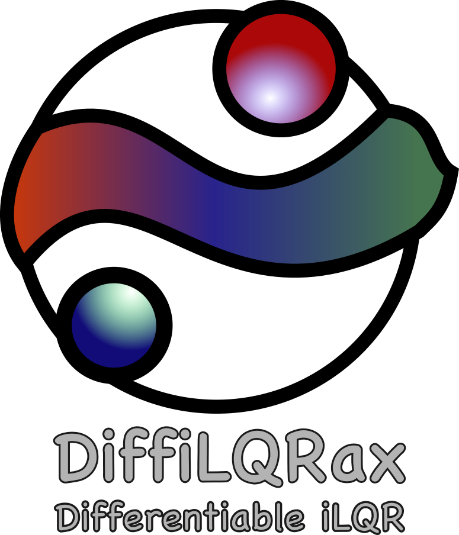
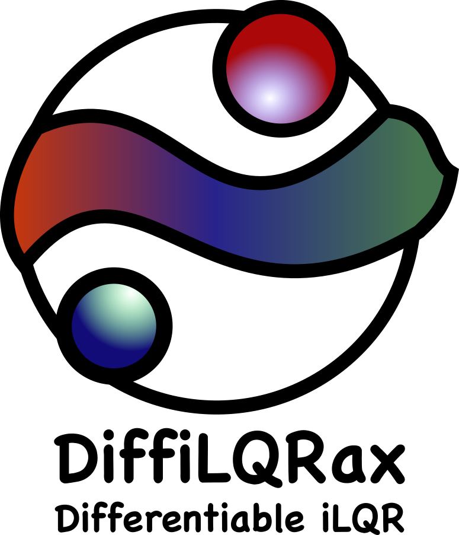

.. DiffiLQRax Documentation master file, created by
   sphinx-quickstart on Thu Dec 19 23:21:29 2024.
   You can adapt this file completely to your liking, but it should at least
   contain the root `toctree` directive.

.. rst-class:: heading-center

Welcome to DiffiLQRax!
====================================

DiffiLQRax is an open source Python package that provides a differentiable implementation of the iterative Linear Quadratic Regulator (iLQR) algorithm using the JAX library. 

Please support the development of DiffiLQRax by starring and/or watching the project on Github!

Examples
---------

.. nbgallery::
    :caption: DiffiLQRax examples
    :name: rst-gallery
    :reversed:
    
   examples/lqr_integrator.ipynb
   examples/lqr_tracking_integrator.ipynb
   examples/gradient_through_ilqr.ipynb
   examples/simple_pendulum.ipynb
   examples/simple_pendulum_with_slider.ipynb
   examples/gradients_through_ilqr.ipynb

Installation
------------

To get started with this code, clone the repository and install the required dependencies. Then, you can run the main script to see the iLQR in action.

.. code-block:: bash

   git clone git@github.com:ThomasMullen/diffilqrax.git
   cd diffilqrax
   python -m build
   pip install -e .

or, you can import from pip install

.. code-block:: bash

   pip install diffilqrax

Contents
--------

.. toctree::
   :maxdepth: 2
   :caption: Contents

   userguide/getting_started
   examples/index
   userguide/design_principles
   about/lqr_theory
   api/modules

Acknowledgements
================
This project has received funding from the European Union’s Horizon 2020 research 
and innovation programme under the Marie Skłodowska-Curie grant agreement #813457.