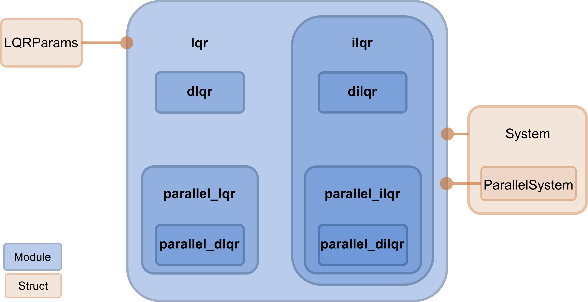

.. _design_principles:
Design Principles
=================

+----------------+------------------------------+----------------+---------------------------------+
| Solver type    | Module                       | Optimal device | Arguments                       |
+================+==============================+================+=================================+
| Dynamic        | ``diffilqrax.lqr``           | CPU            | ``LQRParams``                   |
+----------------+------------------------------+----------------+---------------------------------+
|                | ``diffilqrax.ilqr``          | CPU            | ``ThetaParams, System``         |
+----------------+------------------------------+----------------+---------------------------------+
| Differentiable | ``diffilqrax.diff_lqr``      | CPU/GPU        | ``LQRParams``                   |
+----------------+------------------------------+----------------+---------------------------------+
|                | ``diffilqrax.diff_ilqr``     | CPU/GPU        | ``ThetaParams, System``         |
+----------------+------------------------------+----------------+---------------------------------+
| Associative    | ``diffilqrax.plqr``          | GPU            | ``LQRParams``                   |
+----------------+------------------------------+----------------+---------------------------------+
|                | ``diffilqrax.parallel_ilqr`` | GPU            | ``ThetaParams, ParallelSystem`` |
+----------------+------------------------------+----------------+---------------------------------+

The layout of the modules are hierarchically structure outlined in the schematic below:

